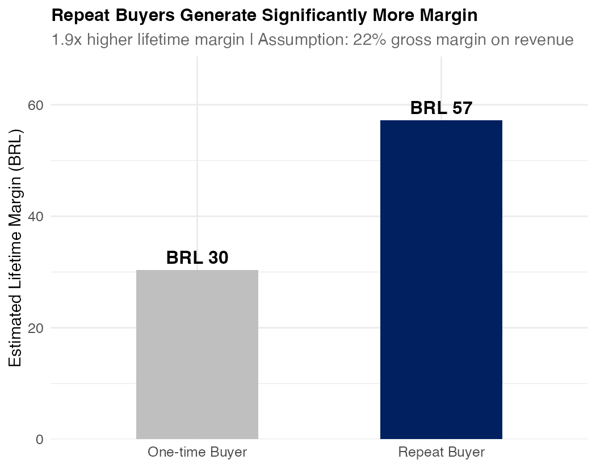
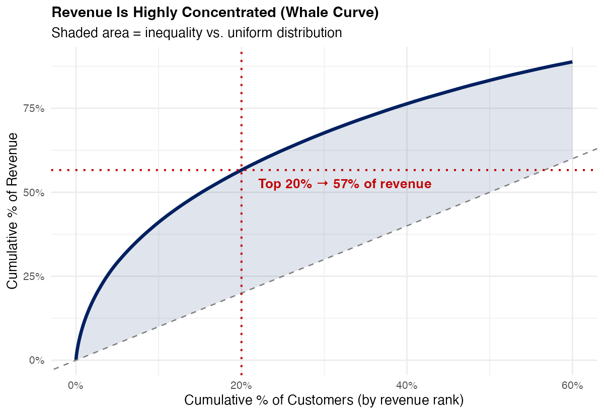
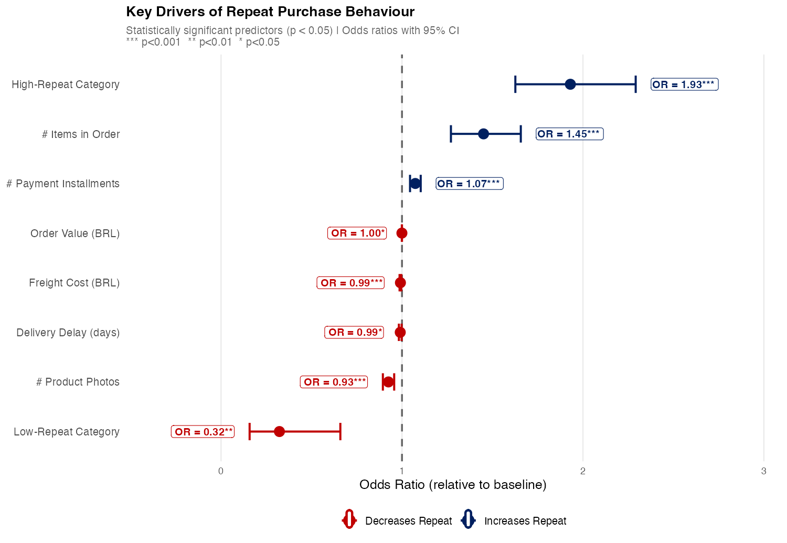
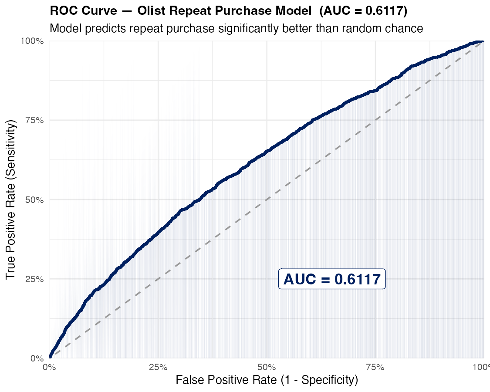
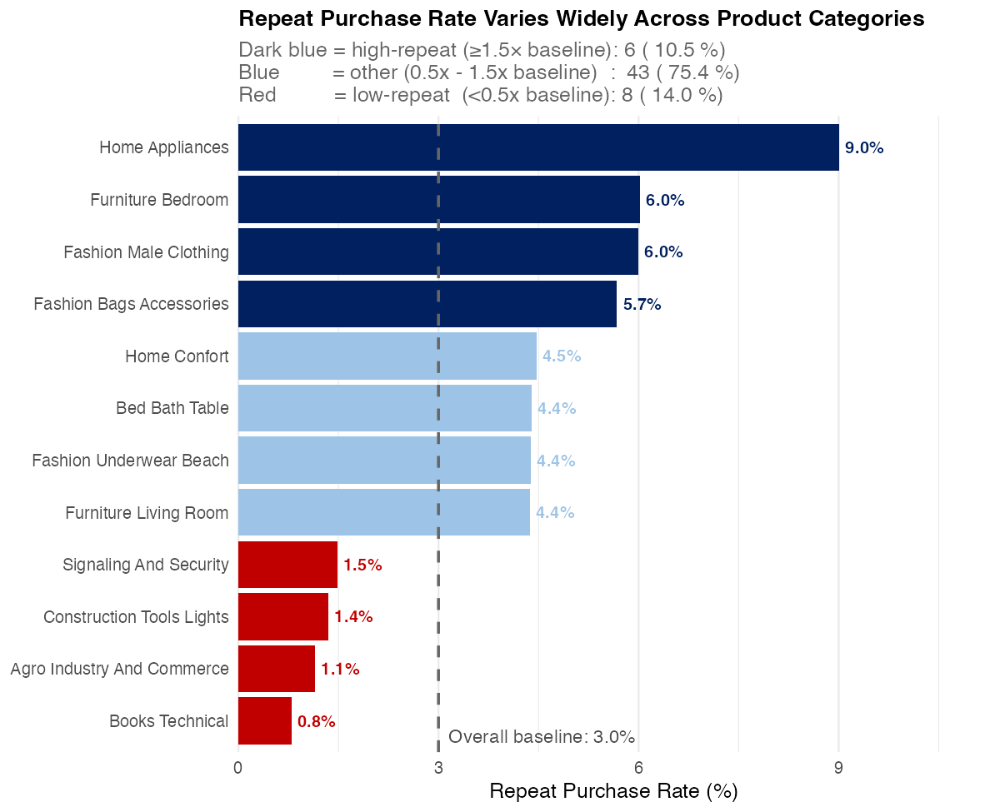
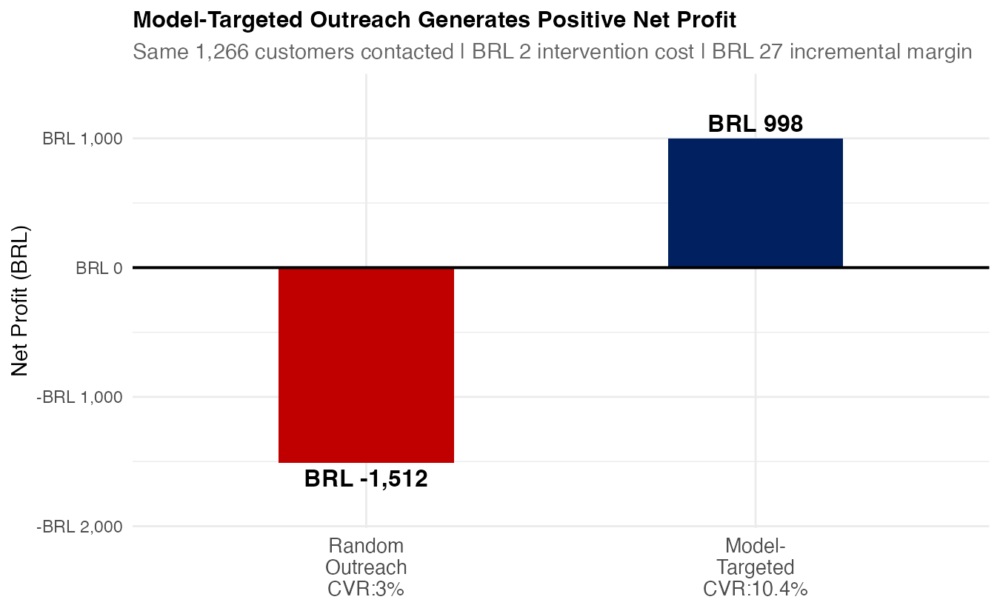
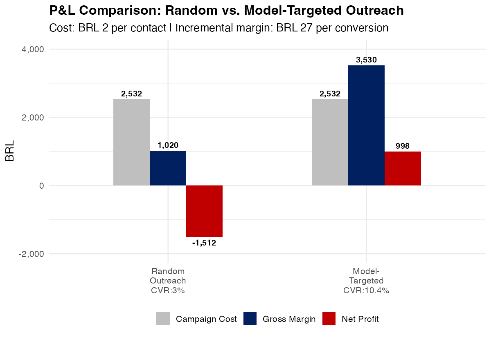

# Olist Customer Retention: From First Purchase to Loyal Customer

Predicting repeat purchase from a customer's **first order alone**, and turning that prediction into a targeted outreach plan with a measured dollar return.

**Dataset:** [Olist Brazilian E-Commerce (Kaggle)](https://www.kaggle.com/datasets/olistbr/brazilian-ecommerce) · 93,358 unique customers · 2016–2018
**Stack:** R (`tidyverse`, `pROC`, `scales`, `ggrepel`)

---

## The business problem

**97% of Olist customers never come back.**

| | |
|---|---|
| 97% | of customers make only one purchase |
| 1.9× | higher lifetime revenue from repeat buyers |
| 57% | of revenue from the top 20% of customers |

Repeat buyers are 1.9× more valuable, so converting even a small share of one-time buyers is the largest untapped margin on the platform.




## The analytics question

> Can we predict, from a customer's first order alone, who is likely to buy again — and is acting on that prediction worth more than contacting people at random?

Outcome variable: `is_repeat` (did the customer place a second order, keyed on `customer_unique_id`).

## Approach

| Step | What and why |
|---|---|
| **1. Balance** | 3.0% true repeat rate is extreme class imbalance. 50/50 undersampling pairs 2,801 repeat buyers with 2,801 one-time buyers so the model can learn the rare pattern. |
| **2. Model** | Logistic regression on 22 features engineered across 7 experience dimensions (order, product, payment, delivery, review, geography, timing). Chosen for interpretable odds ratios, not just accuracy. |
| **3. Correct** | Probabilities recalibrated from the 50% sample rate back to the 3% base rate with a log-odds shift of −3.48, so predicted probabilities are usable as real-world expectations. |
| **4. Target** | Flag customers above the 7.5% break-even probability, derived from contact cost and margin per conversion. |

## What the model found

**Category is the strongest predictor — stronger than price, delivery speed, or review score.**

| Signal | Odds ratio |
|---|---|
| Bought in a high-repeat category (health & beauty, food, perfumery, baby) | **1.93** |
| Larger basket (more items in the first order) | **1.45** |
| Bought in a low-repeat category (furniture, electronics, tools, auto) | **0.32** |

AUC = 0.6117 · 8 significant predictors (p < 0.05) · balanced sample n = 5,574




The split is behavioural, not demographic: **consumable** categories get repurchased because customers run out; **durable** categories don't, because one purchase satisfies the need.



## The recommendation

Send a re-engagement email within 7 days of delivery to every first-time buyer with predicted P(repeat) > 7.5% — **960 customers, 1.0% of the base** — split into two messages, because the strongest predictor is category rather than demographics:

- **Tier 1, Replenishment** — consumable-category buyers. *"Ready to restock?"* plus a 10% loyalty coupon on the same category. Response is purchase-cycle driven.
- **Tier 2, Discovery** — model-flagged buyers outside consumable categories. Curated cross-category recommendation plus free shipping.

## Economic impact

Assumptions: BRL 2.00 per email · BRL 26.60 incremental margin per conversion · 7.5% break-even threshold · 960 customers contacted.

| | Conversions | |
|---|---|---|
| Random outreach | 29 | |
| Model-targeted | **97** | **+BRL 1,818** |




Targeting 1% of the base with the model returns more than 3× the conversions of contacting the same number of people at random.

## Reproducing this

The raw data is not committed here (it is ~120 MB and belongs to Kaggle). To run the analysis:

1. Download the dataset from [Kaggle](https://www.kaggle.com/datasets/olistbr/brazilian-ecommerce).
2. Unzip the CSVs into a `data/` folder at the repo root.
3. Run `code/BAMA520_Milestone3_Analysis_0323.R`. The script expects `DATA_DIR <- "data/"` and writes its figures to `plot/`.

The `olist_geolocation_dataset.csv` file is not used by this analysis and can be skipped.

## Repository contents

```
├── code/    BAMA520_Milestone3_Analysis_0323.R   # full analysis, steps 1–7
├── plot/    01–11 *.png                          # figures produced by the script
├── report/  final deck                           # the analysis as presented
└── README.md
```

## Context

Course project for **BAMA 520 Customer Analytics**, UBC Sauder MBAN, March 2026. Framed and presented to a Head of Customer Retention persona at Olist.

**My contribution:** I defined the analytical approach and wrote the analysis code. Each of the five team members developed an independent approach and codebase, and mine was selected as the group's submission; slide production was then divided across the team.

## Data and licensing

The Olist dataset is published by Olist on Kaggle under its own terms; it is linked here, not redistributed. All code, figures, and analysis in this repository are the authors' own work.
